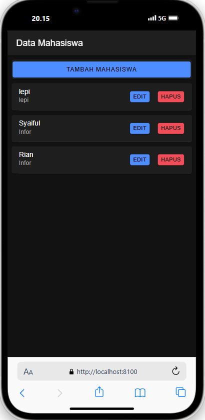
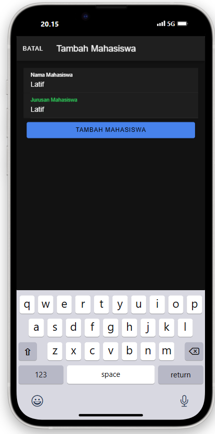
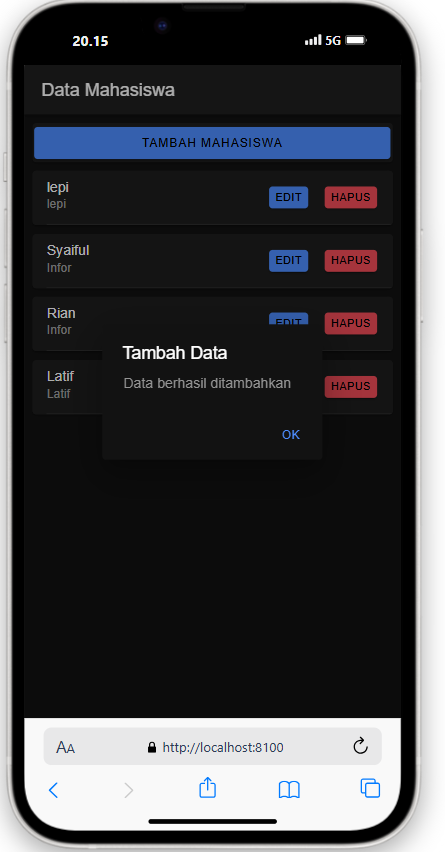
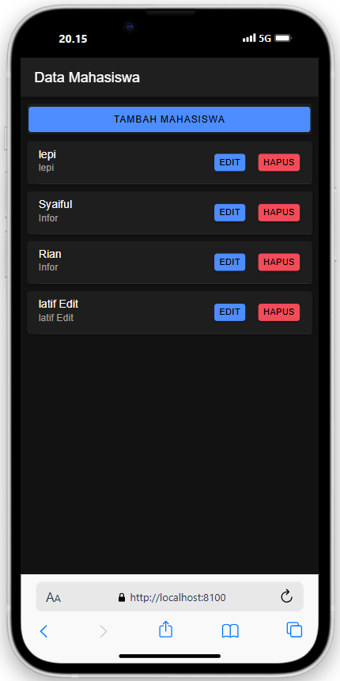
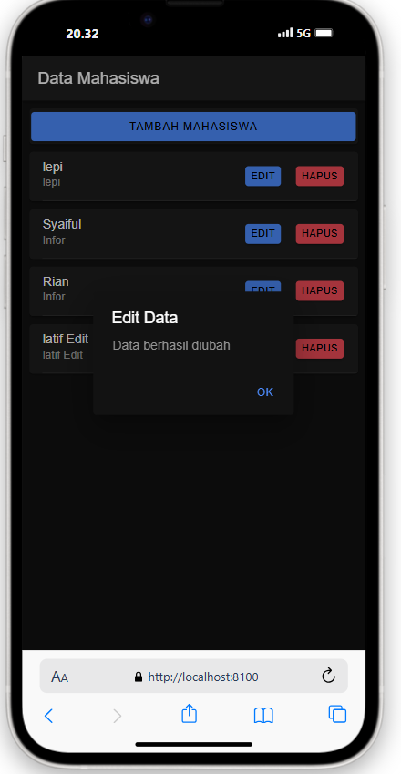
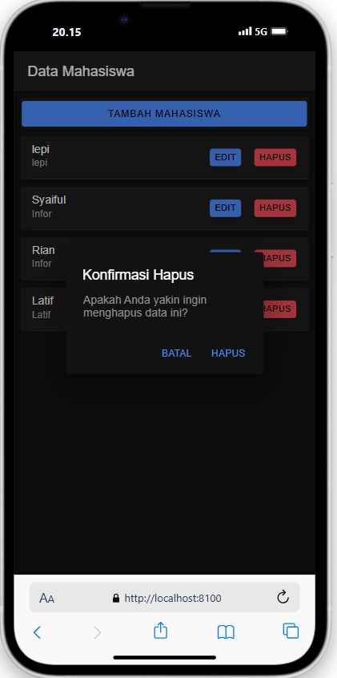
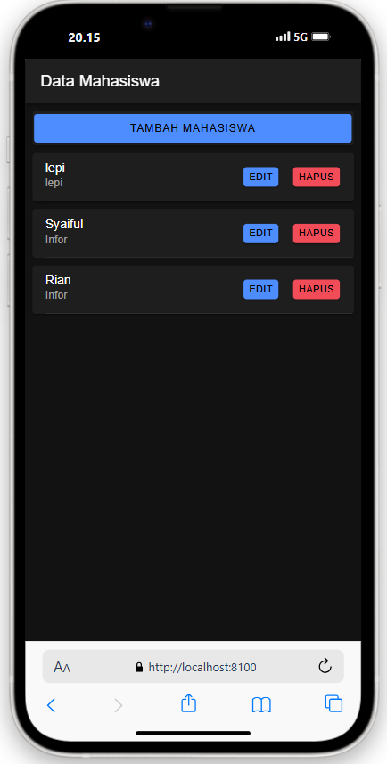

Nama : Muhammad Syaiful Latif
NIM : H1D022025

Proses CRUD
1. Read Data

Method getMahasiswa() dipanggil dalam ngOnInit() untuk mengambil data mahasiswa dari API tampil.php melalui ApiService. Method ini mengirim permintaan GET dan menyimpan respons ke dalam variabel dataMahasiswa untuk ditampilkan di halaman. Jika terjadi kegagalan, pesan error dicatat di konsol untuk debugging.

2. Tambah Data

Method tambahMahasiswa() digunakan untuk menambahkan data mahasiswa baru. Pertama, method ini memeriksa apakah field nama dan jurusan telah diisi; jika belum, data tidak dikirim. Setelah validasi, objek data yang berisi nama dan jurusan dikirim sebagai permintaan POST ke tambah.php melalui ApiService. Jika berhasil, form di-reset, data mahasiswa diperbarui, modal ditutup, dan pesan sukses dicetak di konsol. Jika terjadi kesalahan atau ada field yang kosong, pesan error dicatat di konsol.

3. Edit Data

Method editMahasiswa() digunakan untuk mengedit data mahasiswa berdasarkan ID. Pertama, dibuat objek data yang berisi id, nama, dan jurusan dari form yang diisi pengguna. Objek ini dikirim sebagai permintaan POST ke edit.php melalui ApiService untuk memperbarui data di server. Jika berhasil, form di-reset, data diperbarui di halaman, modal ditutup, dan pesan sukses dicetak di konsol. Jika gagal, pesan error dicatat di konsol untuk debugging.

4. Hapus Data

Method hapusMahasiswa(id: any) digunakan untuk menghapus data mahasiswa berdasarkan ID. Method ini mengirim permintaan DELETE ke hapus.php?id= dengan ID yang ingin dihapus menggunakan ApiService. Jika berhasil, data mahasiswa dimuat ulang untuk memperbarui tampilan, dan pesan sukses dicetak di konsol. Jika gagal, pesan error dicatat di konsol untuk membantu dalam penanganan kesalahan.
